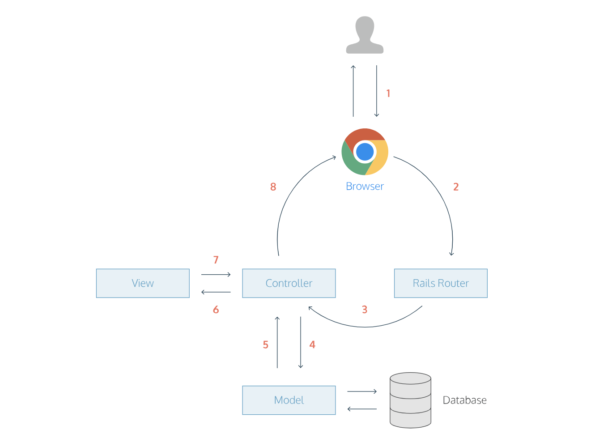

Instagram Challenge
===================


## Task

Build Instagram: Simple huh!

Your challenge is to build Instagram using Rails. You'll need **users** who can post **pictures**, write **comments** on pictures and **like** a picture. Style it like Instagram's website (or more awesome).

Bonus if you can add filters!


## Quickstart

First, clone this repository. Then:

```bash
> bundle install
> bin/rails db:create
> bin/rails db:migrate

> bundle exec rspec # Run the tests to ensure it works
> bin/rails server # Start the server at localhost:3000
```


Remember to proceed in small steps! Getting confused? Make the steps even smaller.

## Code Quality


```
So that I can share my life stories,  
I want to view all posts containing photos
As a user, 
I want to post a photo 

As a user 
I want to view all my posts on a page

As a user  
I want to write a comment on my post

As a user
I want to edit posts I upload

As a user, 
I want to delete photos if I choose to 

As a user, I would like to add filter to photos I upload 


```
## Approach

- TDD
- Web app framework: ruby rails
- Test framework: Rspec

  #### Future Improvements
- 
  #### Contribution
- Pull Requests


### source :codeacademy.com